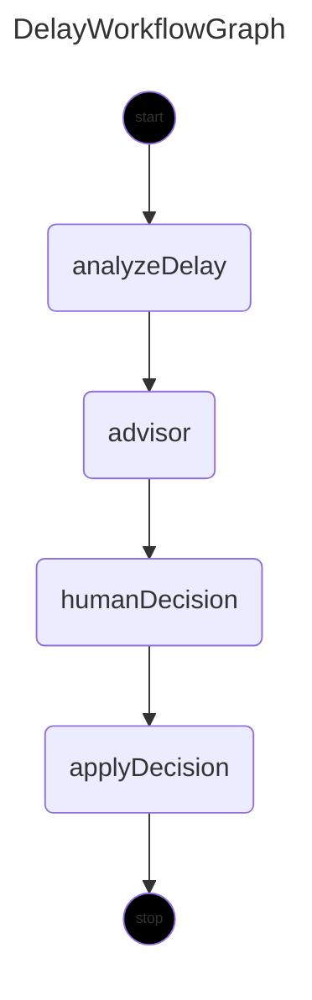

# DelayWorkflowGraph - Diagram of solution

Below the diagram generated by LangGraph4j that represents the workflow of the solution.

## Diagram



## Code Snippet

To get diagram representation directly from graph use the code snippet below:
```java
final var mermaidGraph = graph.getGraph(GraphRepresentation.Type.MERMAID, "DelayWorkflowGraph", false);
System.out.printf("""
        ==========================
        %s
        ==========================
        """, mermaidGraph.content());

```
