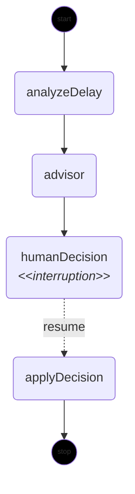

# langgraph4j-demo

[](https://youtube.com/live/bLN1iiTlcLU)

Spring Boot + Vaadin demo of a Deutsche Bahn delay-monitoring workflow built with
[langgraph4j](https://github.com/langgraph4j/langgraph4j), including a human-in-the-loop pause for
deciding what to do about a delay. Built live on stream at
https://youtube.com/live/bLN1iiTlcLU.

**This branch (`feature/langgraph4j-implementation`) is the finished langgraph4j implementation**,
branched off `main`'s pre-stream starting point (where this workflow is a hand-rolled stand-in with
zero langgraph4j involved - see `main`'s README) with the real `StateGraph`, nodes, checkpointing,
and `interruptBefore`/resume wired back in. It exists as a prepared reference/answer to bring `main`
up to date after the stream. See [DEMO_PLAN.md](DEMO_PLAN.md) for implementation notes.

## What it does

You search for a Deutsche Bahn connection, pick one to monitor, and the app polls it for delays in
the background. Once a delay crosses a configurable threshold, a **langgraph4j** `StateGraph` kicks
in: it looks for alternative connections, asks an advisor (rule-based, or a local LLM) to recommend
one, and then **pauses the graph and waits for a human decision** in the browser before finalizing
an outcome. langgraph4j's checkpointing and interrupt/resume mechanics are the centerpiece of the
demo.

## Workflow graph

A langgraph4j `StateGraph` with four nodes and a pause before `humanDecision`:



The graph halts before `humanDecision` (`interruptBefore("humanDecision")`), pushes the paused
state to the browser via Vaadin server push, and resumes with `updateState(...)` +
`GraphInput.resume()` once the user picks a decision - langgraph4j's documented **static
`interruptBefore(nodeName)`**, not a dynamic `interrupt()` function, which isn't present in
langgraph4j-core 1.8.24. See [DIAGRAM.md](DIAGRAM.md) for how to regenerate this diagram straight
from the compiled graph.


```mermaid
---
Sequence Diagram of Application
---
sequenceDiagram
    title: Sequence Diagram of Application
    autonumber
    actor User
    participant Browser as Browser<br/>&lt;&lt;Vaadin UI>>
    participant DbApi as client<br/>DbApiClient
    participant Monitor as service<br/>DelayMonitorService
    participant Orchestrator as service<br/>WorkflowOrchestrationService
    participant Workflow as workflow<br/>&lt;&lt;LangGraph4j>>

    %% Step 1: Search & Pick Journey
    User->>Browser: Search for journeys
    Browser->>DbApi: search()
    DbApi-->>Browser: Journey results
    User->>Browser: Pick a journey

    %% Step 2: Monitoring & Delay Simulation
    alt Scheduled Polling
        loop @Scheduled
            Monitor->>Monitor: Poll journey status
        end
    else Manual Simulation
        User->>Browser: Click "Simulate delay"
        Browser->>Monitor: Trigger delay
    end

    %% Step 3: Threshold Breach & Workflow Trigger
    Note over Monitor: Threshold breach detected
    Monitor->>Orchestrator: Trigger workflow execution
    Orchestrator->>Workflow: Start langgraph4j run

    %% Step 4: Automated Graph Execution
    activate Workflow
    Workflow->>Workflow: analyzeDelay
    Workflow->>Workflow: advisor

    Note over Workflow: Interrupt hit:<br/>interruptBefore("humanDecision")
    Workflow-->>Orchestrator: Pause workflow execution
    deactivate Workflow

    Orchestrator->>Browser: Push paused state (Vaadin Server Push)
    Browser-->>User: Display decision prompt

    %% Step 5: Human Decision & Graph Resume
    User->>Browser: Pick a decision
    Browser->>Orchestrator: Submit decision
    Orchestrator->>Workflow: graph.updateState(...)
    Note over Workflow: Resume with human decision
    Orchestrator->>Workflow: graph.stream(GraphInput.resume(), config)

    activate Workflow
    Workflow->>Workflow: humanDecision
    Workflow->>Workflow: applyDecision
    Workflow-->>Orchestrator: Workflow complete (END)
    deactivate Workflow

    Orchestrator->>Browser: Push final outcome (Vaadin Server Push)
    Browser-->>User: Display final outcome
```

## Tech stack

- Spring Boot 4.1.0 + Vaadin 25.2.6 (Flow) + Java 21.
- [`org.bsc.langgraph4j:langgraph4j-core:1.8.24`](https://github.com/langgraph4j/langgraph4j) for
  the workflow engine.
- [api.transitous.org](https://transitous.org/) for journey data - a public MOTIS instance
  aggregating GTFS/GTFS-RT feeds across Europe (including Deutsche Bahn's own DELFI feed), free, no
  API key. Previously this used `v6.db.transport.rest` (`db-vendo-client`), but Deutsche Bahn's own
  backend started blocking that whole ecosystem via TLS fingerprinting in 2026 - see
  [DbApiClient](src/main/java/dev/rabauer/bahndemo/client/DbApiClient.java) for details and the
  [upstream issue](https://github.com/public-transport/db-vendo-client/issues/46). `DbApiClient`
  falls back to a small hardcoded offline dataset on any failure (timeout, 503, ...) so the demo
  stays reliable regardless of that API's availability.

- Optional LLM advisor node via **Spring AI's Ollama integration**
  (`spring-ai-starter-model-ollama`, model `llama3.2`), gated behind `bahn.advisor.enabled` so the
  app builds and runs with zero external dependencies by default. `docker-compose.yml` runs Ollama
  alongside the app and enables it.

## Running it

Locally, no external dependencies (rule-based advisor only):

```bash
mvn spring-boot:run
```

Fully dockerized, including Ollama and the LLM-backed advisor:

```bash
docker compose up
```

First run pulls the `llama3.2` model into a named volume, which can take a few minutes; the app
becomes reachable at http://localhost:8080 once that's done.

Run the tests:

```bash
mvn test
```

## Configuration

Set in [`application.yml`](src/main/resources/application.yml), overridable via environment
variables (as `docker-compose.yml` does):

| Property | Default | Purpose |
| --- | --- | --- |
| `bahn.api.base-url` | `https://api.transitous.org` | Journey planning API (MOTIS) |
| `bahn.api.default-results` | `10` | Number of connections/locations returned per search |
| `bahn.delay.threshold-seconds` | `300` | Delay (in seconds) that triggers the workflow |
| `bahn.delay.poll-interval-ms` | `30000` | Monitoring poll interval |
| `bahn.advisor.enabled` | `false` | Enables the LLM-backed advisor node (needs Ollama reachable) |
| `spring.ai.ollama.base-url` | `http://localhost:11434` | Ollama endpoint |
| `spring.ai.ollama.chat.options.model` | `llama3.2` | Model used by the advisor node |

## Project structure

Base package: `dev.rabauer.bahndemo`

- `client` - `DbApiClient` + DTOs for api.transitous.org (MOTIS).
- `workflow` - `DelayWorkflowState` (the graph's state, extends langgraph4j's `AgentState`),
  `DelayWorkflowConfig` (graph wiring), `HumanDecision` enum, `workflow.node.*` (the four
  `NodeAction` implementations: analyze, advise, human decision, apply decision).

- `service` - `AdvisorService` (+ rule-based/LLM implementations), `MonitoredJourney` /
  `MonitoredJourneyRegistry`, `DelayMonitorService` (polling + the demo-safety "simulate delay"
  trigger), `WorkflowOrchestrationService` (the Vaadin ↔ langgraph4j bridge).
- `ui` - `MainView` + `JourneySearchPanel` / `JourneyResultsGrid` / `MonitoringPanel`.
- `config` - `AppShellConfig` (`@Push`), `RestClientConfig`, `AsyncConfig`, `BahnDemoProperties`.

See [DEMO_PLAN.md](DEMO_PLAN.md) for the full architecture write-up, including implementation
notes and gotchas encountered while building this (serialization requirements for the
`MemorySaver` checkpointer, Vaadin component scoping, advisor bean resolution, and API timeouts).
